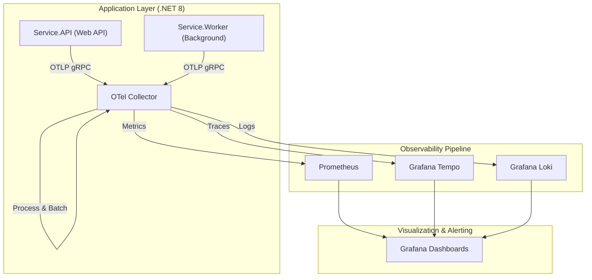

# End-to-End OpenTelemetry (OTel) Observability Stack (.NET 8 + Grafana)

  

## 📌 Overview

This repository demonstrates a **production-ready Observability Architecture** implementing the **OpenTelemetry (OTel)** standard. It features a scalable, decoupled design using the **OTel Collector** as a telemetry hub, processing signals from a **.NET 8 Microservices** reference application and exporting them to a best-in-class **OSS Observability Backend** (Prometheus, Loki, Tempo, Grafana).

Designed to showcase **SRE (Site Reliability Engineering)** best practices, this project implements:
-   **Golden Signals Monitoring** (Latency, Traffic, Errors, Saturation).
-   **Distributed Tracing** with Head-based Probabilistic Sampling for cost control.
-   **Log Aggregation** correlated with Traces and Metrics.
-   **Governance** via strict telemetry naming standards and semantic conventions.

## 🏗 Architecture

The system follows a sidecar/agentless model where services push OTLP (OpenTelemetry Protocol) data to a central collector.



## 🛠 Technology Stack

-   **Instrumentation**: OpenTelemetry .NET SDK (Auto-instrumentation + Manual Business Metrics).
-   **Ingestion**: OpenTelemetry Collector Contrib (Processor pipelines for batching, scrubbing PII, and resource semantic tagging).
-   **Metrics**: Prometheus (Pull-based).
-   **Tracing**: Grafana Tempo (High-volume distributed tracing).
-   **Logs**: Grafana Loki (Label-based log aggregation).
-   **Visualization**: Grafana 10.x (Provisioned Dashboards).
-   **Infrastructure**: Docker Compose (Infrastructure as Code).

## 🚀 Getting Started

### Prerequisites
-   Docker Desktop / Docker Compose
-   .NET 8 SDK

### Quick Start
1.  **Spin up the Infrastructure**:
    ```bash
    docker compose up -d
    ```
    *This starts the Collector, Prometheus, Tempo, Loki, and Grafana.*

2.  **Start the Microservices**:
    ```bash
    cd src
    dotnet run --project Service.API/Service.API.csproj &
    dotnet run --project Service.Worker/Service.Worker.csproj &
    ```

3.  **Generate Traffic**:
    -   **Golden Signals**: Visit `http://localhost:5000/weatherforecast` to generate HTTP traffic.
    -   **Business Logic**: Simulate orders:
        ```bash
        curl -X POST http://localhost:5000/checkout
        ```

4.  **Explore Observability**:
    -   Access **Grafana** at [http://localhost:3000](http://localhost:3000).
    -   Navigate to **Dashboards** > **Service Overview**.

## 📊 Key Features & Implementation Details

### 1. SRE "Golden Signals" Dashboard
A pre-provisioned Grafana dashboard (`grafana/dashboards/service_overview.json`) visualizes the four golden signals:
-   **Availability**: Derived from HTTP 5xx error rates (`http_server_duration_count`).
-   **Latency**: P95/P99 histograms (`http_server_duration_bucket`).
-   **Throughput**: Request rates per second.
-   **Error Budget**: Burn rate visualization.

### 2. Business Metric Telemetry
Beyond operational metrics, the apps emit high-value business KPIs:
-   **Metric**: `orders_created_total`
-   **Attributes**: `currency`, `plan_type`
-   **Code Reference**: `Service.API/Program.cs` - `BusinessMetrics` class.

### 3. Cost-Efficient Tracing
Implemented **Head-based Probabilistic Sampling** (10%) to demonstrate cost control in high-throughput environments while maintaining visibility into errors and high-latency outliers.

### 4. Alerting & Runbooks
-   **Prometheus Rules**: `prometheus_rules.yml` defines alerts for "High Error Rate (>5%)" and "High Latency".
-   **Incident Management**: See `docs/runbooks/high_error_rate.md` for the standard operating procedure (SOP) on incident resolution.

## 📂 Repository Structure

-   `/src`: .NET 8 Source Code (Clean Architecture).
-   `/docs`: Governance/SRE standards and Runbooks.
-   `/grafana`: IaC for Dashboards and Datasources.
-   `otel-collector-config.yaml`: The core pipeline configuration.

## 🤝 Contributing
This project is open for extension. Please refer to `docs/governance.md` for telemetry naming conventions before submitting a PR.
