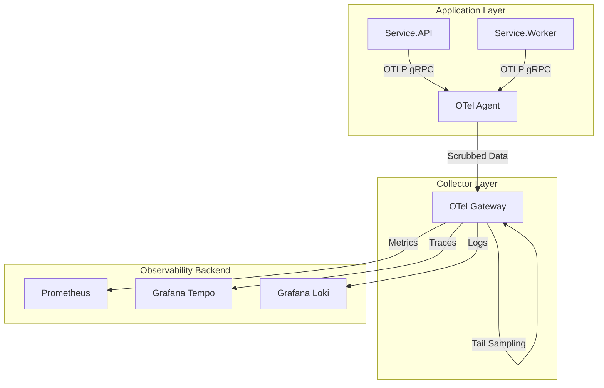

# Architecture & Design

This project implements a **Two-Tier OpenTelemetry Architecture** designed to simulate a production Kubernetes deployment using Docker Compose.

## High-Level Diagram

## Components

### 1. OTel Agent (Sidecar Pattern)
*   **Role**: Mimics a DaemonSet agent running on every node.
*   **Responsibility**:
    *   **Immediate Offload**: Accepts OTLP data from apps fast.
    *   **Preprocessing**: Scrubs PII (e.g., emails) using the `transform` processor.
    *   **Enrichment**: Adds infrastructure tags.
*   **Config**: `otel-agent-config.yaml`

### 2. OTel Gateway (Aggregator Pattern)
*   **Role**: Mimics a central Deployment of collectors.
*   **Responsibility**:
    *   **Tail-Based Sampling**: Makes retention decisions based on the *complete* trace.
    *   **Routing**: Exports data to the correct backend.
*   **Config**: `otel-gateway-config.yaml`

### 3. Sampling Strategy
We use **Head-Based Sampling** at the SDK (10%) and **Tail-Based Sampling** at the Gateway.

#### Tail Policies
1.  **Always Sample Errors**: If `status_code == ERROR`, keep it.
2.  **Always Sample Slow Requests**: If latency > 1000ms, keep it.
3.  **Probabilistic**: For everything else, keep 1%.
